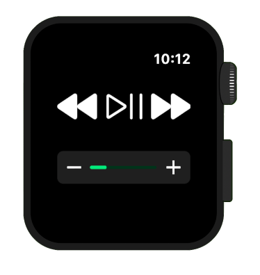
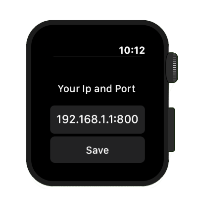

## **RIFI v0.02**
This is the official repo for Wireless Multimedia controller App/Program "RIFI"

Tested on : MacOS | Windows 10 | Manjaro *Linux*

---

##        

Multimedia Controller

IP Input field

> Installation:
>
> `git clone "repo"`
>
> `pip install -r requirements.txt`

> Usage:
>
> `python main.py` *on the host computer*
>
> *Open App > input ip of the computer > Save > Scroll to multimedia.*

---

### So how does this work?

- Python stars a local server *using flask (library)* 
  - Port : 8000 (configurable)
  - ip : Local host ip (eg: 192.168.1.4)
- Listens for Inputs (Play/pause, volume up...)
- Performs the keystrokes in the Laptop that is running flask.

Basically this transforms an Apple Watch to a virtual remote enabling it to controll multimedia.

Uses:

- While Playing a music in laptop (Play/Pause) (Skip) (Volume up/down) 

- While Watching Movie and keyboard/mouse is a bit too far to reach.

- While playing music to skip tracks and since the keystrokes are configurable they can be use to initiate custom shortcuts.

---

To Do:

- Refactor and Document the code.

- Add a barcode scanner for easy-login. *Instead of inputting the ip scan a barcode?*

- Package the python and iOS application.

  

*Thanks a lot for all the feedback and suggestions, Feel free to raise an issue, submit feature request.*
